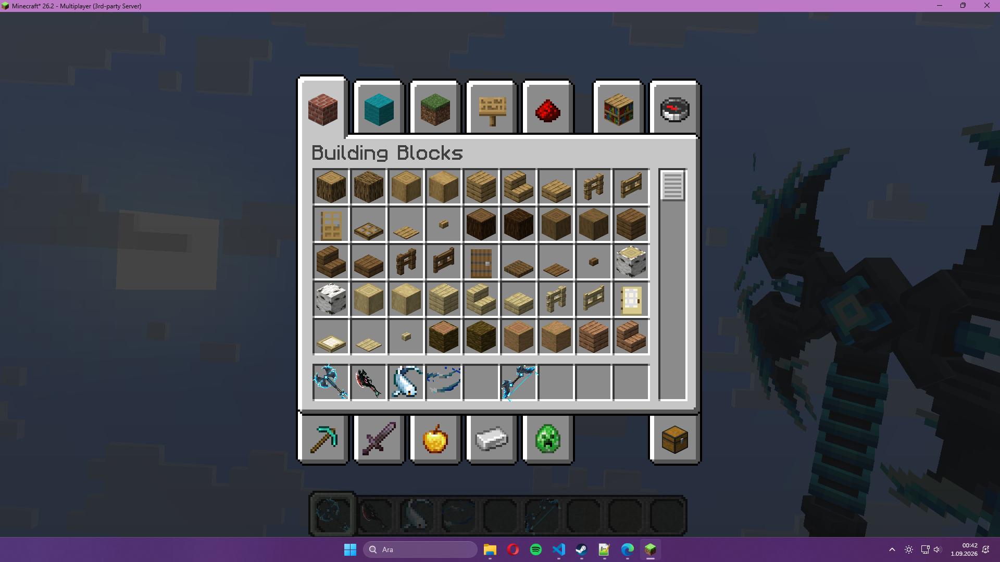
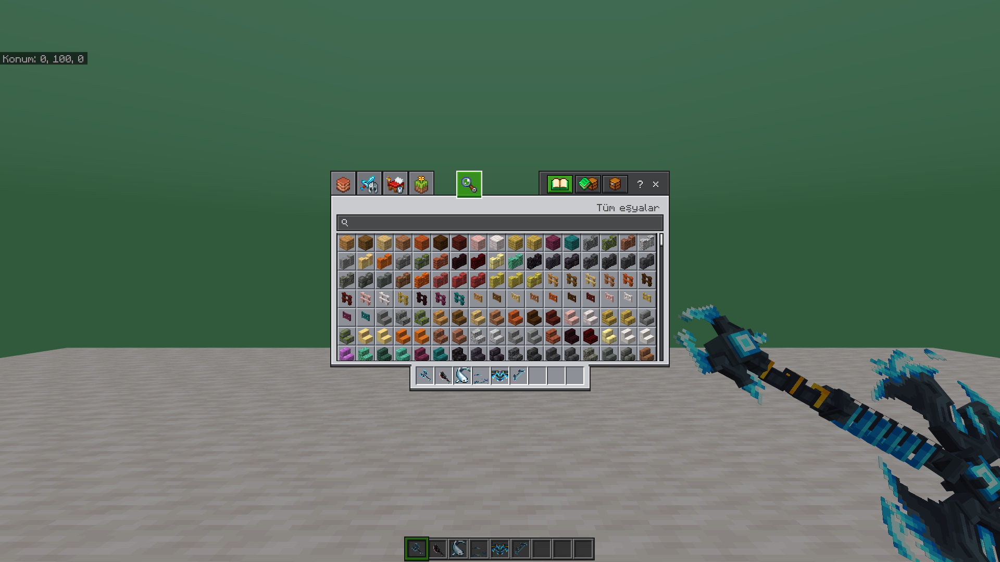
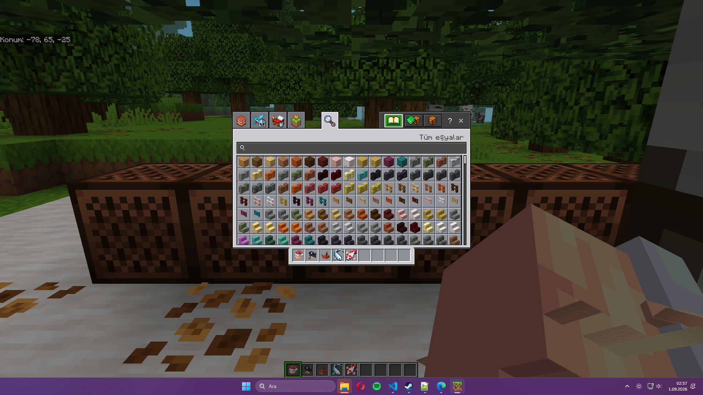
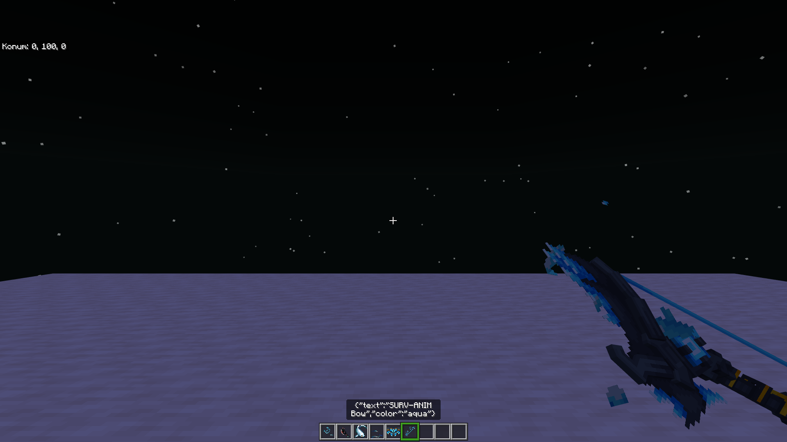
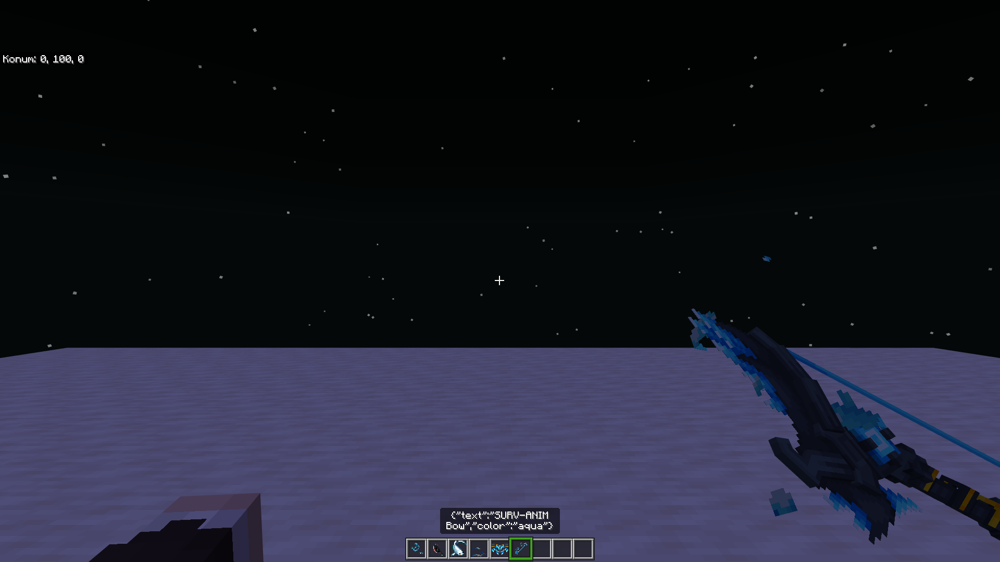
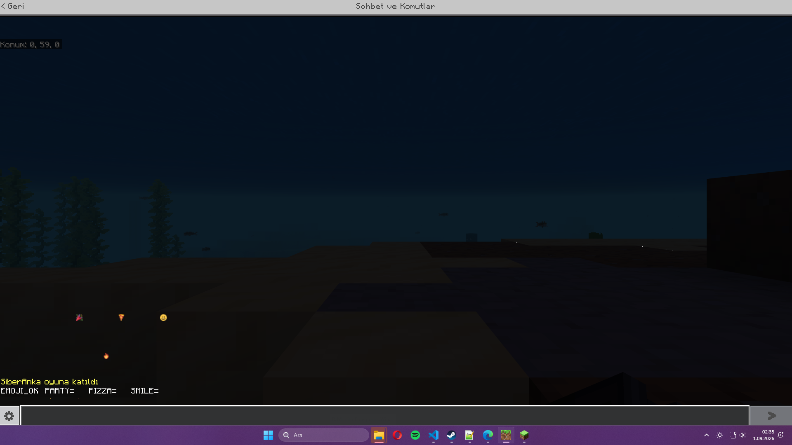

# Twilight

[](LICENSE.LESSER)
[](#requirements)
[](https://github.com/siberanka/twilight/actions/workflows/build-release.yml)
[](https://gitlab.com/siberanka/twilight/-/pipelines)

Twilight is a server-side Java-to-Bedrock custom-content compiler for Geyser. It discovers content generated by server plugins and datapacks, converts supported Java item assets into a Bedrock resource pack, writes Geyser custom mappings, validates the result, and can deploy it transactionally. Players do not install a client mod.

The current capability matrix and version-specific limitations are documented in [docs/COMPATIBILITY.md](docs/COMPATIBILITY.md). Strict conversion fails closed when content cannot be represented safely.

## Visual acceptance tests

These captures come from real Java and Bedrock acceptance sessions. They exercise converted geometry, inventory presentation, item-state selection, layered/custom item assets, and bitmap-font glyphs.

<table>
  <tr>
    <th>Java 3D source</th>
    <th>Bedrock 3D conversion</th>
  </tr>
  <tr>
    <td></td>
    <td></td>
  </tr>
  <tr>
    <td colspan="2" align="center"><strong>Layered and custom item inventory pass</strong><br></td>
  </tr>
  <tr>
    <th>Bow idle state</th>
    <th>Bow full-draw state</th>
  </tr>
  <tr>
    <td></td>
    <td></td>
  </tr>
  <tr>
    <td colspan="2" align="center"><strong>Bitmap-font and emoji glyph pass</strong><br></td>
  </tr>
</table>

## Requirements

- Java 21 or newer
- Spigot, Paper, or Folia 1.21.4 or newer
- Geyser with custom content enabled for generated mappings and packs

The release artifact is one server plugin: `Twilight.jar`. Fabric client support has ended.

## Discovery and automation

Twilight resolves `level-name` from `server.properties`, active Bukkit worlds, their datapacks, and generated content under supported provider directories. Current discovery recognizes ItemsAdder, CraftEngine, Nexo, Oraxen, BetterModel, ModelEngine, RealisticSeasons, and explicitly configured pack sources. Provider `contents`/`resources`, `data`, and `cache` metadata and asset roots are indexed in that order of authority; generated ZIPs remain the lower-priority fallback for files absent from those roots. Standard assets remain the source of truth, so compatible providers can work through the file and Bukkit APIs without vendor-specific conversion code.

The runtime collector inspects recipe results, online player inventories, modern `minecraft:item_model` components, legacy custom model data, and public ItemsAdder, CraftEngine, Nexo, and Oraxen item registries when available. Supported provider load, reload, and pack-generation events plus content-changing commands trigger a debounced conversion and delayed settle check. File discovery remains available when an API shape changes.

## Installation

1. Put `Twilight.jar` in the server's `plugins` directory.
2. Start the server once and review `plugins/Twilight/config.yml`.
3. Keep `vanilla-override: false` unless replacing vanilla presentation is intentional.
4. Run `/twilight scan`, then `/twilight convert`.
5. Review `plugins/Twilight/reports`, `plugins/Twilight/logs`, and `plugins/Twilight/build/current`.

With default automation enabled, Twilight performs a delayed conversion after server/provider loading, deploys a validated build to the local Geyser directory, and requests a controlled Geyser reload. A failed strict build never replaces the last known-good output.

## Commands

| Command | Purpose |
|---|---|
| `/twilight status` | Show operation, scan, Geyser, and backup state. |
| `/twilight scan` | Discover and inspect sources without converting. |
| `/twilight convert` | Scan, convert, validate, and optionally deploy. `/twilight build` is an alias. |
| `/twilight deploy` | Deploy the current validated output to Geyser. |
| `/twilight rollback [index]` | Restore a retained Geyser deployment snapshot. |
| `/twilight reload` | Reload and validate Twilight configuration. |

Each operation writes a dedicated UTF-8 log under `plugins/Twilight/logs`, for example `convert-log-20260921-153000-000-a1b2c3d4.txt`. Logs include phases, selected sources, counts, isolated conversion problems, the executing thread, and complete stack traces.

## Conversion and safety contract

- Modern Java item-definition trees support plain models, conditions, range dispatch, selects, static composites, and special-model bases where Geyser has an equivalent predicate.
- Legacy numeric custom-model-data overrides remain supported.
- Layered 2D textures are composed without smoothing. Java cuboids remain volumetric Bedrock geometry with separate first/third-person left/right and head transforms.
- Single-layer texture-only bows and crossbows reuse Bedrock's native pose, pull geometry, and animation controllers. Volumetric legacy pull stages retain separate Java geometry and display transforms behind one runtime-selected Bedrock attachable. Crossbow arrow/rocket loads and fishing-rod cast models become explicit Geyser predicates, preserving their distinct states.
- Bitmap providers are converted into bounded Bedrock Unicode pages with nearest-neighbor scaling and per-glyph baseline isolation. Named fonts contribute only globally safe, collision-free BMP private-use glyphs.
- With `vanilla-override: false`, normal Unicode cells in the Java default font cannot replace Bedrock's vanilla glyphs. Named-font cells that need contextual remapping or collide globally stop strict publication instead of corrupting menus or chat.
- Explicit `minecraft:` texture references missing from a custom pack can be resolved from a version-matched Mojang client JAR cached under `plugins/Twilight/cache`. Manifest metadata, size, and SHA-1 are verified before use; this never registers vanilla models as custom content.
- Layered Java `sounds.json` registries, file/event references, OGG assets, weights, pitch, volume, streaming, and attenuation are converted to Bedrock sound definitions. Explicit vanilla sound dependencies use the same version-matched, hash-verified Mojang asset chain.
- Vanilla items without a custom definition are never registered. `vanilla-override` defaults to `false`.
- ZIP traversal, symbolic source entries, oversized sources, malformed output JSON, empty archives, duplicate deployment targets, and hash mismatches stop publication.
- Builds use staging plus last-known-good replacement. Geyser deployment stages and hashes every owned file, rolls back on failure, leaves unrelated Geyser files untouched, and retains the newest three snapshots by default.
- Generated archive ordering and timestamps are normalized for repeatable output.

## API and events

Other plugins can obtain the non-blocking Bukkit service:

```java
TwilightApi twilight = Bukkit.getServicesManager().load(TwilightApi.class);
if (twilight != null && !twilight.isOperationRunning()) {
    twilight.requestConvert();
}
```

Twilight fires `TwilightScanCompleteEvent`, `TwilightBuildCompleteEvent`, `TwilightDeployCompleteEvent`, and `TwilightOperationFailedEvent` on the server scheduler. The failure event includes the per-operation log path and original exception.

## Building and local validation

```powershell
$env:JAVA_HOME='<path-to-jdk-25>'
$env:GRADLE_OPTS='-Djavax.net.ssl.trustStoreType=Windows-ROOT'
.\gradlew.bat :twilight:build --no-daemon --no-configuration-cache
```

The JAR is written to `twilight/build/libs/Twilight.jar`.

## License

Twilight is maintained by `siberanka` and licensed under LGPL-3.0-or-later. Provider names belong to their respective owners and indicate compatibility targets, not affiliation.
